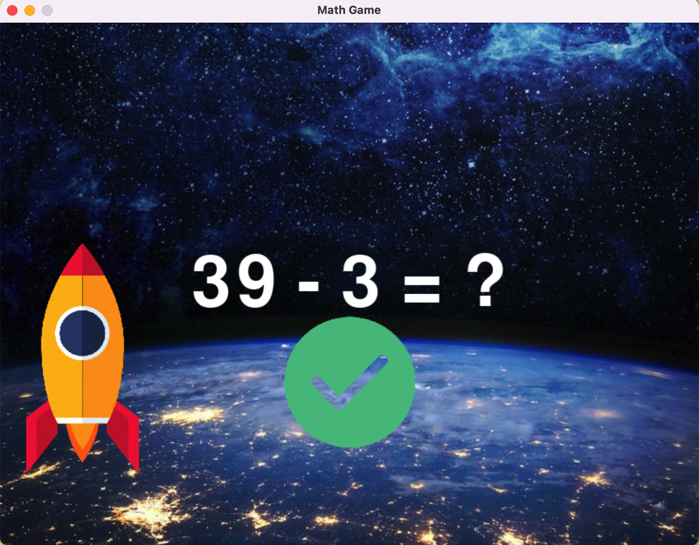
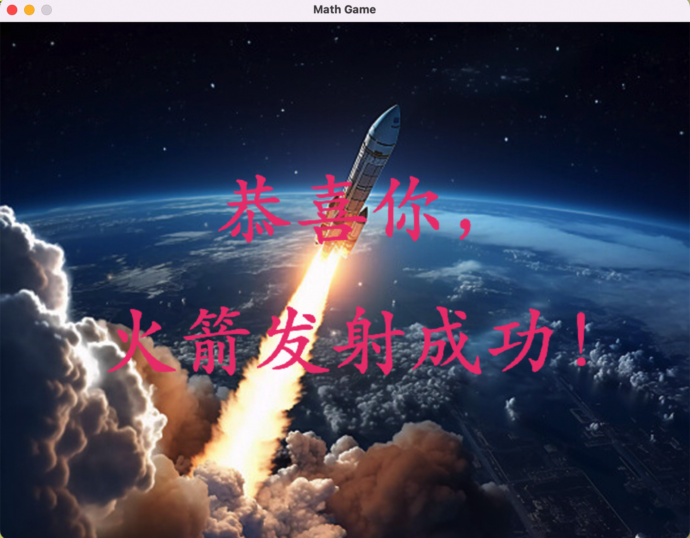

# 数字火箭发射器 Digital Rocket Launcher

## 软件设计

欢迎体验数字火箭发射器！在这个宇宙冒险中，你将通过解决一系列有趣的数学问题，助力火箭顺利升空。

**启动火箭**：在每一关开始时，你需要解决一个数学问题来启动你的火箭。当你的数学问题计算正确的时候，你的火箭将会顺势上升一格。如果你的数学问题回答错误，你的火箭将会下降一格。



**火箭升空**：当你答对十题数学问题时，目标就达成啦！你的专属火箭将会顺利升空！



## 操作指南

- 启动程序: 运行 `main.py` 文件
```shell
python3 main.py
```
- 游戏开始后，输入答案后按回车键提交答案

## 运行说明

- 本程序需要在 Python 3 环境下运行, 请确保你的 Python 版本在 3.6 以上
- 安装依赖库
```shell
pip3 install -r requirements.txt
```